<div align="center">



<br />

### The keyboard-first terminal multiplexer for Windows — built for AI coding agents

**Workspaces · split panes · ConPTY · OSC & idle notifications · session daemon · scriptable CLI**

<br />

[](https://github.com/GitDakky/cmux-windows/releases/latest)
[](https://github.com/GitDakky/cmux-windows/actions/workflows/ci.yml)
[](https://github.com/GitDakky/cmux-windows)
[](https://dotnet.microsoft.com/download/dotnet/10.0)
[](LICENSE)

<br />

[**Download latest release**](https://github.com/GitDakky/cmux-windows/releases/latest) · [**Changelog**](CHANGELOG.md) · [**Docs**](docs/SETUP.md) · [**Report issue**](https://github.com/GitDakky/cmux-windows/issues)

</div>

---

## GitDakky distribution

**[GitDakky/cmux-windows](https://github.com/GitDakky/cmux-windows)** is the maintained Windows distribution of cmux — not a dormant fork. It ships CI-tested releases, agent notification workflows, and production-oriented packaging (`cmuxw.exe`, `cmux-daemon.exe`, `cmux` CLI).

| | |
| :-- | :-- |
| **Maintainer** | [GitDakky](https://github.com/GitDakky) |
| **Lineage** | [mkurman/cmux-windows](https://github.com/mkurman/cmux-windows) · conceptually aligned with macOS [cmux](https://github.com/manaflow-ai/cmux) |
| **Current version** | **v1.0.8** |

---

## Why cmux on Windows?

<table>
<tr>
<td width="25%" align="center"><strong>Multiplexer UX</strong><br/><sub>tmux-like flows, native WPF</sub></td>
<td width="25%" align="center"><strong>Real ConPTY</strong><br/><sub>Not a faux terminal</sub></td>
<td width="25%" align="center"><strong>Agent attention</strong><br/><sub>OSC, CLI, idle, toasts</sub></td>
<td width="25%" align="center"><strong>Automation</strong><br/><sub>Named-pipe <code>cmux</code> CLI</sub></td>
</tr>
</table>

| Problem | What cmux does |
| :-- | :-- |
| Context switching across repos | **Workspaces** with git branch & cwd in the sidebar |
| One shell is never enough | **Surfaces** (tabs) + **split panes** with keyboard focus |
| Missing agent “waiting for you” signals | **OSC 9/99/777**, `cmux notify`, idle heuristic, unread badges |
| Lost sessions after restart | **`cmux-daemon.exe`** persistence + Session Vault transcripts |
| Mouse-heavy workflows | **Command palette**, shortcuts, dark theme |

---

## Quick install

> **Requires Windows 10 build 17763+ or Windows 11.** Self-contained — no separate .NET install.

```text
1. Download  cmux-windows-v1.0.8-win-x64.zip  from Releases
2. Extract    app\cmuxw.exe  +  app\cmux-daemon.exe  +  cli\cmux.exe
3. Run        app\cmuxw.exe
4. Optional   Add cli\ to PATH  →  cmux notify / workspace / split
```

<div align="center">

[](https://github.com/GitDakky/cmux-windows/releases/latest)

</div>

SmartScreen may flag unsigned builds — **More info → Run anyway** if you trust this release.

---

## Feature highlights

| Category | Capabilities |
| :-- | :-- |
| **Terminal** | ConPTY backend, scrollback, copy/paste, resize debounce, shell profiles (PowerShell, CMD, WSL, Git Bash) |
| **Layout** | Workspaces, surfaces, vertical/horizontal splits, zoom pane, restore on launch |
| **Agents** | OSC notifications, `cmux notify`, idle detection, process heuristics (Claude, Codex, Cursor, …) |
| **Attention** | Unread on workspace / tab / pane, toasts & taskbar flash (configurable) |
| **Productivity** | Command palette, inline search, command logs & history, snippets |
| **Persistence** | Session daemon, transcript capture, Session Vault browser |
| **Config** | `%USERPROFILE%\.cmux-windows\config.json` (+ legacy fallback) |

---

## Agent hooks (30 seconds)

Start **cmuxw**, put **`cmux.exe`** on `PATH`, then from PowerShell or an agent hook:

```powershell
cmux notify --title "Claude Code" --body "Waiting for your input"
```

Optional helper install:

```powershell
.\scripts\install-agent-hooks.ps1
```

**Settings → Behaviour** — toggle toasts, taskbar flash, and idle detection.

---

## First five minutes

| Step | Action |
| :--: | :-- |
| 1 | Launch `cmuxw.exe` |
| 2 | `Ctrl+N` — new workspace |
| 3 | `Ctrl+T` — new surface (tab) |
| 4 | `Ctrl+D` / `Ctrl+Shift+D` — split right / down |
| 5 | `Ctrl+Shift+P` — command palette |
| 6 | `Ctrl+I` — notifications · `Ctrl+Shift+U` — jump to unread |
| 7 | `Ctrl+,` — settings |

---

## Documentation

| Document | Description |
| :-- | :-- |
| [CHANGELOG.md](CHANGELOG.md) | Release history (GitDakky) |
| [docs/SETUP.md](docs/SETUP.md) | SDK, build, publish |
| [docs/config.example.json](docs/config.example.json) | Example configuration |
| [docs/MANUAL-TEST-CHECKLIST.md](docs/MANUAL-TEST-CHECKLIST.md) | Windows validation checklist |
| [docs/KNOWN-LIMITATIONS.md](docs/KNOWN-LIMITATIONS.md) | Platform & parity notes |
| [docs/ROADMAP.md](docs/ROADMAP.md) | Post-MVP roadmap |
| [docs/MVP-PLAN.md](docs/MVP-PLAN.md) | MVP scope & status |
| [docs/AUDIT-INITIAL.md](docs/AUDIT-INITIAL.md) | Initial codebase audit |

---

## Build from source

```powershell
git clone https://github.com/GitDakky/cmux-windows.git
cd cmux-windows
.\scripts\smoke-test.ps1
.\scripts\publish-win-x64.ps1   # cmuxw + cmux-daemon + cmux + versioned zip
```

**Requirements:** Windows 10/11, [.NET 10 SDK](https://dotnet.microsoft.com/download/dotnet/10.0), [WebView2](https://developer.microsoft.com/microsoft-edge/webview2/) for browser panes.

```powershell
dotnet run --project src/Cmux/Cmux.csproj -c Debug
```

---

<details>
<summary><strong>Keyboard shortcuts</strong></summary>

### Workspaces

| Shortcut | Action |
| :-- | :-- |
| `Ctrl+N` | New workspace |
| `Ctrl+1` … `Ctrl+8` | Jump to workspace |
| `Ctrl+9` | Last workspace |
| `Ctrl+Shift+W` | Close workspace |
| `Ctrl+B` | Toggle sidebar |

### Surfaces & panes

| Shortcut | Action |
| :-- | :-- |
| `Ctrl+T` | New surface |
| `Ctrl+W` | Close surface |
| `Ctrl+D` | Split right |
| `Ctrl+Shift+D` | Split down |
| `Ctrl+Alt+Arrow` | Focus adjacent pane |
| `Ctrl+Shift+Z` | Zoom pane |

### Productivity

| Shortcut | Action |
| :-- | :-- |
| `Ctrl+Shift+P` | Command palette |
| `Ctrl+Shift+F` | Search |
| `Ctrl+Shift+L` | Command logs |
| `Ctrl+Shift+V` | Session vault |
| `Ctrl+Alt+H` | Command history |
| `Ctrl+I` | Notifications |
| `Ctrl+Shift+U` | Jump to unread |
| `Ctrl+,` | Settings |

</details>

<details>
<summary><strong>CLI reference</strong></summary>

```powershell
cmux notify --title "Title" --body "Message"
cmux workspace list
cmux workspace create --name "My Project"
cmux workspace select --index 0
cmux surface create
cmux split right
cmux split down
cmux status
```

IPC: `\\.\pipe\cmux` (Windows named pipe).

</details>

<details>
<summary><strong>Screenshots</strong></summary>

<p align="center">
  
</p>
<p align="center">
  
</p>
<p align="center">
  
</p>

</details>

<details>
<summary><strong>Architecture</strong></summary>

```text
src/
  Cmux/         WPF app (cmuxw.exe)
  Cmux.Core/    terminal, IPC, config, services
  Cmux.Cli/     automation client (cmux.exe)
  Cmux.Daemon/  session persistence (cmux-daemon.exe)
tests/Cmux.Tests/
```

</details>

---

## Configuration

| Path | Role |
| :-- | :-- |
| `%USERPROFILE%\.cmux-windows\config.json` | Primary (read/write) |
| `%LOCALAPPDATA%\cmux\settings.json` | Legacy read fallback |

---

## Contributing

Issues and pull requests welcome at **[github.com/GitDakky/cmux-windows](https://github.com/GitDakky/cmux-windows)**.

---

<div align="center">

**cmux for Windows** · maintained by [**GitDakky**](https://github.com/GitDakky) · MIT License

</div>
